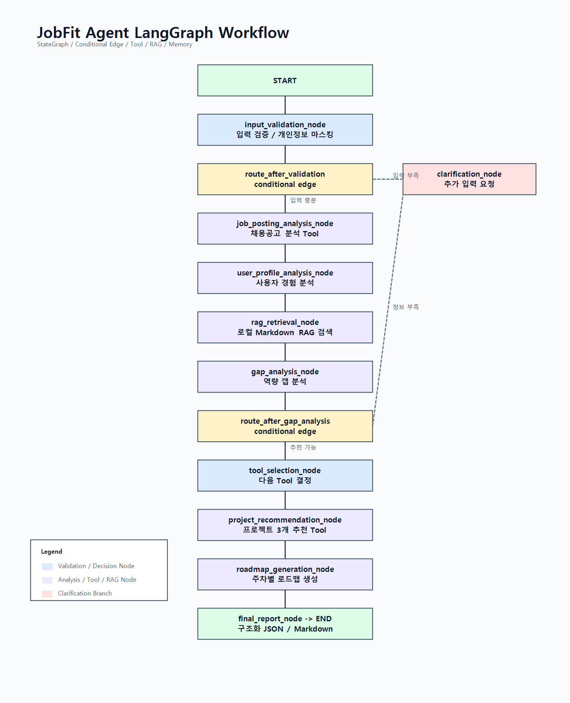
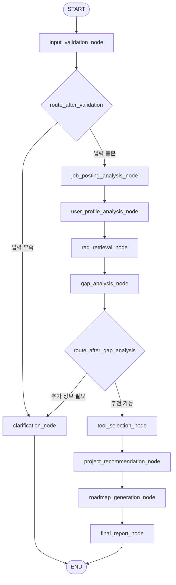

# JobFit Agent

JobFit Agent는 취업준비생이 목표 직무의 채용공고, 회사 인재상, 본인의 기술스택과 프로젝트 경험을 입력하면 채용공고 기준의 역량 갭, 보완 학습 항목, 추천 프로젝트, 실행 로드맵, Markdown 리포트를 생성하는 Agent 서비스입니다.

이 저장소는 두 부분으로 구성되어 있습니다.

- `backend/`: 최종 평가 핵심입니다. Python + LangChain + LangGraph 기반 Agent Core, Tool, RAG, Memory, Middleware, FastAPI, CLI 데모를 포함합니다.
- `src/`: Next.js + TypeScript 기반 UI입니다. 입력 Wizard, 결과 화면, Human-in-the-loop, Markdown 다운로드, Python backend 호출 옵션을 제공합니다.

평가 요구사항은 `backend/`의 Python LangGraph Agent 기준으로 충족합니다. Next.js는 발표용 UI와 보조 데모 역할입니다.

## 목차

1. [서비스 소개](#서비스-소개)
2. [문제 정의](#문제-정의)
3. [사용 시나리오](#사용-시나리오)
4. [전체 아키텍처](#전체-아키텍처)
5. [LangGraph Workflow](#langgraph-workflow)
6. [Backend 구성](#backend-구성)
7. [Frontend 구성](#frontend-구성)
8. [설치 및 실행](#설치-및-실행)
9. [환경변수](#환경변수)
10. [FastAPI API](#fastapi-api)
11. [CLI 데모](#cli-데모)
12. [LangChain Tool](#langchain-tool)
13. [RAG](#rag)
14. [Memory](#memory)
15. [Middleware / Guardrail](#middleware--guardrail)
16. [Pydantic / OutputParser](#pydantic--outputparser)
17. [Next.js UI 사용법](#nextjs-ui-사용법)
18. [개인정보 보호](#개인정보-보호)
19. [발표 데모 흐름](#발표-데모-흐름)
20. [검증 명령어](#검증-명령어)
21. [평가 요구사항 충족표](#평가-요구사항-충족표)
22. [한계점 및 향후 개선](#한계점-및-향후-개선)
23. [자주 나는 오류](#자주-나는-오류)

## 서비스 소개

JobFit Agent는 채용공고와 사용자 경험 사이의 차이를 분석해 취업 준비 계획으로 바꾸는 서비스입니다.

사용자는 다음 정보를 입력합니다.

- 목표 직무
- 채용공고 원문
- 회사 인재상 또는 핵심가치
- 사용자 기술스택
- 사용자 프로젝트 경험
- 자기소개서 또는 경험 서술
- 준비 가능 기간
- 선호 프로젝트 방식
- 현재 수준

Agent는 다음 결과를 제공합니다.

- 채용공고 요구역량 요약
- 사용자 보유 역량 분석
- 부족 역량과 우선순위
- 공부로 보완할 항목
- 프로젝트로 증명할 항목
- 추천 프로젝트 3개
- 선택 기간 기준 학습 로드맵
- 포트폴리오 산출물 체크리스트
- Markdown 최종 리포트

## 문제 정의

취업준비생은 채용공고를 읽어도 실제로 어떤 역량을 준비해야 하는지 판단하기 어렵습니다.

주요 문제는 다음과 같습니다.

- 채용공고의 담당업무, 필수사항, 우대사항을 구조화하기 어렵습니다.
- 본인의 프로젝트 경험이 공고 요구사항을 얼마나 증명하는지 알기 어렵습니다.
- 공부로 보완할 항목과 프로젝트로 증명할 항목을 구분하기 어렵습니다.
- 준비 기간이 짧을 때 무엇을 줄이고 무엇을 남겨야 하는지 판단하기 어렵습니다.
- 포트폴리오 README와 면접에서 어떤 근거를 보여줘야 하는지 명확하지 않습니다.

JobFit Agent는 이 문제를 LangGraph 기반 Agent workflow로 나누어 처리합니다.

## 사용 시나리오

대표 사용자는 백엔드 개발 직무를 준비하는 취업준비생입니다.

1. 사용자가 백엔드 개발 채용공고를 입력합니다.
2. 회사 인재상과 협업 문화 문구를 입력합니다.
3. 본인의 FastAPI, Docker, 프로젝트 경험, 자기소개서 내용을 입력합니다.
4. 준비 기간을 4주로 선택합니다.
5. Agent가 채용공고와 사용자 경험을 비교합니다.
6. RAG가 로컬 직무 지식 문서를 검색해 추천 근거를 보강합니다.
7. Agent가 부족 역량, 추천 프로젝트, 4주 로드맵을 생성합니다.
8. 사용자는 Human-in-the-loop 패널에서 “너무 어려움”, “더 실무적으로” 같은 피드백을 입력합니다.
9. 선택한 프로젝트 기준으로 로드맵을 다시 생성합니다.
10. 최종 Markdown 리포트를 다운로드합니다.

멀티턴 예시:

```text
1턴: 백엔드 개발 직무에 맞춰 분석해줘
2턴: Docker 경험은 있는데 Kubernetes는 없어
3턴: 4주 안에 가능한 프로젝트로 줄여줘
```

## 전체 아키텍처

```mermaid
flowchart LR
    user[사용자] --> ui[Next.js UI]
    user --> cli[Python CLI Demo]
    user --> docs[FastAPI /docs]

    ui --> proxy[Next.js API Proxy<br/>/api/python-agent/jobfit]
    proxy --> api[FastAPI Backend<br/>/agent/jobfit]
    cli --> graph[LangGraph StateGraph]
    docs --> api

    api --> guard[Middleware / Guardrail]
    guard --> graph

    graph --> tools[LangChain Tools]
    graph --> rag[RAG<br/>Markdown docs + Chroma]
    graph --> memory[Memory<br/>session_id + MemorySaver]

    tools --> response[AgentResponse / FinalReport]
    rag --> response
    memory --> response

    response --> dashboard[ResultDashboard]
    response --> markdown[Markdown Report]
```

실행 경로는 크게 3개입니다.

- FastAPI 단독 실행: `POST /agent/jobfit`
- CLI 실행: `python cli_demo.py --sample --once`
- Next.js UI 실행: Wizard에서 `Python LangGraph Agent 사용` 옵션 선택

## LangGraph Workflow

Workflow 구현 위치:

- `backend/app/graph_workflow.py`
- `backend/app/graph_nodes.py`
- `backend/app/graph_state.py`
- `backend/docs/workflow.mmd`
- `backend/docs/workflow.md`
- `docs/workflow.mmd`
- `docs/WORKFLOW_DIAGRAM.md`
- `docs/workflow.png`

이미지 다이어그램:



Mermaid 다이어그램:



### Workflow Node

| Node | 역할 |
| --- | --- |
| `input_validation_node` | 입력 길이, 필수값, 개인정보 마스킹, 추가 입력 필요 여부를 검사합니다. |
| `job_posting_analysis_node` | 채용공고와 회사 인재상에서 담당업무, 필수역량, 우대역량, 기술 키워드를 추출합니다. |
| `user_profile_analysis_node` | 사용자 기술스택, 프로젝트 경험, 자기소개서에서 확인된 역량과 근거가 약한 역량을 나눕니다. |
| `rag_retrieval_node` | 목표 직무와 부족 역량 기준으로 로컬 RAG 문서를 검색합니다. |
| `gap_analysis_node` | 공고 요구역량과 사용자 보유역량을 비교합니다. |
| `tool_selection_node` | 다음 실행 단계와 사용 Tool을 결정합니다. |
| `project_recommendation_node` | 부족 역량을 증명할 프로젝트 3개를 추천합니다. |
| `roadmap_generation_node` | 준비 기간 기준 학습 및 프로젝트 로드맵을 생성합니다. |
| `final_report_node` | 최종 구조화 응답과 Markdown 리포트 기반 데이터를 생성합니다. |
| `clarification_node` | 입력이 부족하면 추가 입력 요청 메시지를 생성하고 종료합니다. |

### Conditional Edge

`backend/app/graph_workflow.py`에는 조건부 분기가 2개 있습니다.

| 함수 | 분기 | 설명 |
| --- | --- | --- |
| `route_after_validation` | `clarification` / `analyze` | 필수 입력이 부족하면 추가 질문으로 종료하고, 충분하면 공고 분석으로 진행합니다. |
| `route_after_gap_analysis` | `clarification` / `recommend` | 갭 분석 후 핵심 정보가 부족하면 추가 질문으로 종료하고, 충분하면 프로젝트 추천으로 진행합니다. |

Mermaid 문자열은 API로도 확인할 수 있습니다.

```powershell
curl http://127.0.0.1:8000/agent/workflow-mermaid
```

## Backend 구성

`backend/README_BACKEND.md`의 핵심 내용을 메인 README에도 포함했습니다. 평가자는 이 섹션과 `backend/` 코드를 보면 Python 제출 요구사항을 확인할 수 있습니다.

```text
backend/
  main.py                         FastAPI 엔트리포인트
  cli_demo.py                     터미널 실행용 CLI 데모
  requirements.txt                Python 의존성
  .env.example                    backend 환경변수 예시
  README_BACKEND.md               backend 빠른 안내

  app/
    api.py                        FastAPI route
    config.py                     pydantic-settings 기반 환경변수 로딩
    graph_state.py                LangGraph state TypedDict
    graph_nodes.py                LangGraph node 함수
    graph_workflow.py             StateGraph 구성, conditional edge, MemorySaver
    memory.py                     session_id 기반 인메모리 저장소
    middleware.py                 입력 검증, 마스킹, 로깅, 안전한 에러
    schemas.py                    Pydantic 요청/응답 모델, OutputParser

  tools/
    job_posting_tools.py          analyze_job_posting_tool
    project_tools.py              search_jobfit_rag_tool, recommend_project_tool
    report_tools.py               generate_markdown_report_tool

  rag/
    loader.py                     Markdown 문서 로딩 및 chunk 분할
    retriever.py                  Chroma vector store, embedding, 검색
    documents/
      backend_skills.md
      embedded_skills.md
      interview_evaluation_criteria.md
      it_infra_skills.md
      portfolio_checklist.md
      project_templates.md

  docs/
    workflow.mmd                  Mermaid workflow 원본
    workflow.md                   Workflow 설명 문서
```

### Backend 핵심 파일

| 파일 | 역할 |
| --- | --- |
| `backend/main.py` | FastAPI 앱 생성, middleware 설치, router 등록 |
| `backend/app/api.py` | `/health`, `/agent/jobfit`, `/agent/workflow-mermaid` 엔드포인트 |
| `backend/app/graph_workflow.py` | LangGraph `StateGraph`, conditional edge, MemorySaver 구성 |
| `backend/app/graph_nodes.py` | Agent workflow node 함수 |
| `backend/app/schemas.py` | Pydantic 모델과 `PydanticOutputParser` |
| `backend/app/middleware.py` | guardrail, 개인정보 마스킹, 안전한 에러 응답 |
| `backend/app/memory.py` | `session_id` 기반 인메모리 세션 저장 |
| `backend/tools/` | LangChain `StructuredTool` 구현 |
| `backend/rag/` | 로컬 Markdown 문서 기반 RAG |
| `backend/cli_demo.py` | FastAPI 없이 실행 가능한 CLI 데모 |

## Frontend 구성

```text
src/
  app/
    layout.tsx
    page.tsx
    globals.css
    api/
      analyze/gap/route.ts
      analyze/job-posting/route.ts
      analyze/user-profile/route.ts
      recommend/projects/route.ts
      recommend/roadmap/route.ts
      report/final/route.ts
      python-agent/jobfit/route.ts

  components/jobfit/
    InputWizard.tsx
    ResultDashboard.tsx
    HumanReviewPanel.tsx
    DemoDataButton.tsx
    MarkdownExportButton.tsx
    StatusNotice.tsx
    steps/
    results/

  lib/
    ai/
    demo/
    errors/
    privacy/
    prompts/
    report/
    schemas/
    types/
```

### Frontend 핵심 파일

| 파일 | 역할 |
| --- | --- |
| `src/components/jobfit/InputWizard.tsx` | 입력 Wizard, 분석 실행, Python Agent 호출, 결과 상태 관리 |
| `src/app/api/python-agent/jobfit/route.ts` | Next.js에서 Python FastAPI backend로 요청을 넘기는 proxy |
| `src/components/jobfit/ResultDashboard.tsx` | 최종 분석 결과 표시 |
| `src/components/jobfit/HumanReviewPanel.tsx` | 준비 기간, 수준, 프로젝트 선호, 피드백 기반 로드맵 재생성 |
| `src/components/jobfit/MarkdownExportButton.tsx` | Markdown 미리보기, 복사, 다운로드 |
| `src/lib/schemas/jobfit.ts` | Zod 입력/출력 schema |
| `src/lib/report/markdown.ts` | Markdown 리포트 생성 |

## 설치 및 실행

Windows PowerShell 기준입니다.

### 1. Python 가상환경 생성

```powershell
cd C:\Ucode\11_AIboot_FINAL
python -m venv .venv
.\.venv\Scripts\Activate.ps1
python -m pip install --upgrade pip
pip install -r backend\requirements.txt
```

PowerShell 실행 정책 때문에 `Activate.ps1`이 막히면 현재 터미널에서만 허용합니다.

```powershell
Set-ExecutionPolicy -Scope Process -ExecutionPolicy RemoteSigned
.\.venv\Scripts\Activate.ps1
```

가상환경 활성화 없이 직접 실행할 수도 있습니다.

```powershell
C:\Ucode\11_AIboot_FINAL\.venv\Scripts\python.exe -m pip install -r backend\requirements.txt
```

### 2. Python backend 실행

터미널 1:

```powershell
cd C:\Ucode\11_AIboot_FINAL
.\.venv\Scripts\Activate.ps1
cd backend
python -m uvicorn main:app --reload --port 8000
```

정상 확인:

```powershell
curl http://127.0.0.1:8000/health
```

FastAPI 문서:

```text
http://127.0.0.1:8000/docs
```

### 3. Next.js UI 실행

터미널 2:

```powershell
cd C:\Ucode\11_AIboot_FINAL
npm install
npm run dev
```

브라우저:

```text
http://127.0.0.1:3000
```

backend와 frontend는 각각 다른 터미널에서 계속 실행해야 합니다.

## 환경변수

### 루트 `.env.example`

```env
OPENAI_API_KEY=
OPENAI_MODEL=gpt-4o-mini
MOCK_AI=true
NEXT_PUBLIC_AGENT_BACKEND_URL=http://127.0.0.1:8000

JOBFIT_BACKEND_MOCK=true
JOBFIT_BACKEND_LOG_LEVEL=INFO
```

### backend `.env.example`

```env
OPENAI_API_KEY=
OPENAI_MODEL=gpt-4o-mini
EMBEDDING_MODEL=text-embedding-3-small
APP_ENV=development
```

### 환경변수 설명

| 이름 | 사용 위치 | 설명 |
| --- | --- | --- |
| `OPENAI_API_KEY` | Next.js server route, Python backend | OpenAI API Key입니다. 코드에 하드코딩하지 않습니다. |
| `OPENAI_MODEL` | Next.js / Python backend | 사용할 모델명입니다. 기본 예시는 `gpt-4o-mini`입니다. |
| `EMBEDDING_MODEL` | Python RAG | OpenAI embedding 모델명입니다. |
| `MOCK_AI` | Next.js API route | `true`이면 Next.js 자체 Mock AI 경로가 동작합니다. |
| `NEXT_PUBLIC_AGENT_BACKEND_URL` | Next.js proxy | Python backend 주소입니다. 기본값은 `http://127.0.0.1:8000`입니다. |
| `APP_ENV` | Python backend | 실행 환경명입니다. |

API Key가 없어도 Python backend는 hash embedding fallback과 규칙 기반 fallback으로 발표용 데모를 실행할 수 있습니다.

## FastAPI API

구현 위치: `backend/app/api.py`

| Method | Path | 응답 | 설명 |
| --- | --- | --- | --- |
| `GET` | `/health` | `HealthResponse` | 서버 상태, 환경명, 모델명을 반환합니다. |
| `POST` | `/agent/jobfit` | `AgentResponse` 또는 `ErrorResponse` | LangGraph Agent를 실행합니다. |
| `GET` | `/agent/workflow-mermaid` | `text/plain` | LangGraph workflow Mermaid 문자열을 반환합니다. |

### `/agent/jobfit` 요청 필드

`backend/app/schemas.py`의 `JobFitRequest` 기준입니다.

| 필드 | 타입 | 필수 | 설명 |
| --- | --- | --- | --- |
| `session_id` | `str | None` | 선택 | 멀티턴 이력을 구분합니다. 없으면 서버가 생성합니다. |
| `user_message` | `str` | 필수 | 사용자의 자연어 요청입니다. |
| `job_posting` | `str | None` | 권장 | 채용공고 원문입니다. |
| `company_values` | `str | None` | 선택 | 회사 인재상 또는 핵심가치입니다. |
| `user_skills` | `list[str] | None` | 선택 | 사용자 기술스택입니다. |
| `user_projects` | `str | None` | 권장 | 사용자 프로젝트 경험입니다. |
| `self_intro` | `str | None` | 선택 | 자기소개서 또는 경험 서술입니다. |
| `target_role` | `str | None` | 권장 | 목표 직무입니다. |
| `preparation_weeks` | `int | None` | 선택 | 준비 가능 기간입니다. |
| `preferred_project_type` | `str | None` | 선택 | 개인, 팀, 상관없음 등 프로젝트 선호 방식입니다. |

### PowerShell 요청 예시

```powershell
$body = @{
  session_id = "demo-session"
  user_message = "백엔드 개발 직무에 맞춰 역량 갭과 4주 로드맵을 추천해줘"
  target_role = "백엔드 개발"
  job_posting = "담당업무: FastAPI 기반 API 개발, 데이터 모델링, 운영 로그 분석, 역할 분담 문서화. 필수요건: Python, SQL, Docker, 테스트 경험. 우대사항: Redis, CI/CD, 배포 자동화, 모니터링 경험."
  company_values = "협업, 문제해결, 문서화, 지속적인 학습"
  user_skills = @("Python", "FastAPI", "Docker")
  user_projects = "FastAPI API 서버를 만들고 README와 실행 방법을 작성했습니다. Docker로 로컬 실행 환경을 구성했고 pytest로 주요 API를 검증했습니다."
  self_intro = "프로젝트에서 문제를 로그로 분석하고 테스트를 추가해 재발을 줄인 경험이 있습니다."
  preparation_weeks = 4
  preferred_project_type = "개인"
} | ConvertTo-Json -Depth 5

Invoke-RestMethod `
  -Method POST `
  -Uri http://127.0.0.1:8000/agent/jobfit `
  -ContentType "application/json" `
  -Body $body
```

## CLI 데모

구현 위치: `backend/cli_demo.py`

### 샘플 1회 실행

```powershell
cd C:\Ucode\11_AIboot_FINAL
.\.venv\Scripts\Activate.ps1
cd backend
python cli_demo.py --sample --once
```

### 샘플 실행 후 멀티턴 입력

```powershell
python cli_demo.py --sample
```

### 직접 입력 모드

```powershell
python cli_demo.py
```

종료하려면 `exit`를 입력합니다.

## LangChain Tool

구현 위치: `backend/tools/`

| Tool | 파일 | 구현 방식 | 역할 |
| --- | --- | --- | --- |
| `analyze_job_posting_tool` | `job_posting_tools.py` | `StructuredTool.from_function` | 채용공고와 회사 인재상에서 담당업무, 필수역량, 우대역량, 인재상 키워드, 기술 키워드를 추출합니다. |
| `search_jobfit_rag_tool` | `project_tools.py` | `StructuredTool.from_function` | 로컬 Markdown RAG 문서를 검색합니다. |
| `recommend_project_tool` | `project_tools.py` | `StructuredTool.from_function` | 부족 역량, 목표 직무, 준비 기간, 사용자 수준, RAG 근거를 바탕으로 프로젝트 3개를 추천합니다. |
| `generate_markdown_report_tool` | `report_tools.py` | `StructuredTool.from_function` | 최종 분석 결과를 Markdown 보고서 문자열로 변환합니다. |

평가 요구사항의 “최소 2개 이상의 Tool”은 4개 Tool로 충족합니다.

## RAG

구현 위치:

- `backend/rag/loader.py`
- `backend/rag/retriever.py`
- `backend/rag/documents/*.md`

### 검색 대상 문서

| 문서 | 용도 |
| --- | --- |
| `backend_skills.md` | 백엔드 직무 역량, 필수 기술, 프로젝트 기준 |
| `embedded_skills.md` | 임베디드 소프트웨어 직무 기준 |
| `it_infra_skills.md` | IT 인프라 직무 기준 |
| `project_templates.md` | 프로젝트 설계 템플릿 |
| `portfolio_checklist.md` | 포트폴리오 산출물 체크리스트 |
| `interview_evaluation_criteria.md` | 면접 평가 기준 |

### 동작 방식

1. `loader.py`가 `backend/rag/documents/*.md` 파일을 로딩합니다.
2. Markdown 제목과 섹션을 기준으로 chunk를 만듭니다.
3. `retriever.py`가 Chroma `EphemeralClient` collection을 구성합니다.
4. `OPENAI_API_KEY`가 있으면 `OpenAIEmbeddings`를 사용합니다.
5. API Key가 없거나 embedding 호출이 실패하면 `HashEmbeddingProvider`가 fallback으로 동작합니다.
6. 검색 결과는 문서명과 제목 출처를 포함합니다.
7. 검색 결과는 `rag_context`에 저장되어 갭 분석과 프로젝트 추천에 사용됩니다.

이 구조 덕분에 네트워크나 API Key가 없어도 발표용 데모가 멈추지 않습니다.

## Memory

구현 위치:

- `backend/app/memory.py`
- `backend/app/graph_workflow.py`

현재 Memory는 인메모리 방식입니다.

- `session_id` 또는 `thread_id` 기준으로 대화 상태를 분리합니다.
- LangGraph `MemorySaver`를 checkpointer로 사용할 수 있게 구성했습니다.
- `InMemorySessionStore`가 최근 대화 이력과 마지막 GraphState를 저장합니다.
- 후속 질문에서 이전 채용공고, 사용자 경험, 분석 결과를 이어받습니다.
- 서버 재시작 후에는 저장된 이력이 사라집니다.

예시:

```text
1턴: 백엔드 개발 직무에 맞춰 분석해줘
2턴: Docker 경험은 있는데 Kubernetes는 없어
3턴: 4주 안에 가능한 프로젝트로 줄여줘
```

## Middleware / Guardrail

구현 위치: `backend/app/middleware.py`

| 기능 | 설명 |
| --- | --- |
| 입력 길이 제한 | 너무 긴 입력을 제한합니다. |
| 필수 입력 검증 | `user_message`, `job_posting`, `target_role`, 사용자 경험 부족 여부를 판단합니다. |
| 짧은 입력 감지 | 채용공고나 사용자 경험이 너무 짧으면 추가 입력 요청 플래그를 만듭니다. |
| 개인정보 마스킹 | 이메일, 전화번호, 주민등록번호 형태를 정규식 기반으로 마스킹합니다. |
| 안전한 로그 | 채용공고, 자기소개서, 프로젝트 원문은 로그에서 `[REDACTED]` 처리합니다. |
| 안전한 에러 | stack trace, API Key, 내부 오류 정보를 사용자에게 노출하지 않습니다. |
| FastAPI middleware | 요청 path, status, elapsed time, env를 로그로 남깁니다. |

## Pydantic / OutputParser

구현 위치: `backend/app/schemas.py`

### 주요 Pydantic 모델

| 모델 | 역할 |
| --- | --- |
| `JobFitRequest` | Agent 입력 요청 |
| `JobPostingAnalysis` | 채용공고 분석 결과 |
| `UserProfileAnalysis` | 사용자 역량 분석 결과 |
| `GapAnalysis` | 역량 갭 분석 결과 |
| `ProjectRecommendation` | 추천 프로젝트 |
| `RoadmapItem` | 주차별 로드맵 항목 |
| `Roadmap` | 전체 로드맵 |
| `FinalReport` | 최종 구조화 리포트 |
| `AgentResponse` | 정상 API 응답 |
| `ErrorResponse` | 안전한 에러 응답 |

### OutputParser

`get_result_parser()`가 LangChain `PydanticOutputParser`를 제공합니다.

```python
return PydanticOutputParser(pydantic_object=AgentStructuredResult)
```

FastAPI 응답은 `response_model=AgentResponse | ErrorResponse`로 구조화되어 있습니다.

## Next.js UI 사용법

1. `npm run dev`로 UI를 실행합니다.
2. 브라우저에서 `http://127.0.0.1:3000`에 접속합니다.
3. 샘플 데이터 버튼으로 IT 인프라, 임베디드, 백엔드 예시를 채울 수 있습니다.
4. 입력 Wizard의 마지막 단계까지 이동합니다.
5. 기본 Next.js Mock/OpenAI 경로를 사용하려면 그대로 분석을 실행합니다.
6. Python backend를 평가 데모로 보여주려면 `Python LangGraph Agent 사용`을 체크합니다.
7. 분석 결과가 `ResultDashboard`에 표시됩니다.
8. Python LangGraph 원문 JSON 결과는 접기/펼치기 패널로 확인할 수 있습니다.
9. Human-in-the-loop 패널에서 준비 기간, 현재 수준, 프로젝트 선호, 피드백을 수정할 수 있습니다.
10. Markdown 리포트를 미리 보고 복사하거나 `.md` 파일로 다운로드할 수 있습니다.

### Python backend 연결 방식

구현 위치: `src/app/api/python-agent/jobfit/route.ts`

Next.js route handler가 아래 주소로 Python backend를 호출합니다.

```text
http://127.0.0.1:8000/agent/jobfit
```

`localhost` 대신 `127.0.0.1`을 기본값으로 둔 이유는 Windows 환경에서 Node fetch가 IPv6 `::1`로 붙어 uvicorn 연결에 실패하는 경우를 줄이기 위해서입니다.

## 개인정보 보호

- API Key는 `.env`에서만 읽습니다.
- OpenAI API Key를 클라이언트에 전달하지 않습니다.
- 자기소개서, 프로젝트 경험 원문은 DB에 저장하지 않습니다.
- backend Memory는 인메모리 방식이며 서버 재시작 시 사라집니다.
- 이메일, 전화번호, 주민등록번호 형태는 정규식 기반으로 마스킹합니다.
- 민감한 입력 원문은 로그에 남기지 않습니다.
- 내부 stack trace와 API Key는 사용자 응답에 포함하지 않습니다.
- AI 결과는 취업 성공을 보장하지 않는 참고 자료로 표시합니다.

## 발표 데모 흐름

3~5분 발표 기준 추천 흐름입니다.

1. 문제 정의
   - 취업준비생은 채용공고와 자신의 프로젝트 사이의 차이를 판단하기 어렵다고 설명합니다.
2. 아키텍처 설명
   - README의 전체 아키텍처와 LangGraph workflow를 보여줍니다.
3. Backend 단독 실행
   - `python cli_demo.py --sample --once`로 Python Agent가 단독 실행되는 것을 보여줍니다.
4. FastAPI 확인
   - `http://127.0.0.1:8000/docs`에서 `/agent/jobfit`를 보여줍니다.
5. LangGraph 요구사항 설명
   - StateGraph, conditional edge 2개, Tool 4개, RAG, Memory, Middleware를 짚습니다.
6. Next.js UI 데모
   - 샘플 데이터 입력 후 `Python LangGraph Agent 사용`을 체크하고 분석합니다.
7. Human-in-the-loop
   - “너무 어려움”, “4주 안에 가능하게” 같은 피드백으로 로드맵을 조정합니다.
8. Markdown 리포트
   - 최종 보고서를 다운로드합니다.

## 검증 명령어

### Python backend

```powershell
cd C:\Ucode\11_AIboot_FINAL
.\.venv\Scripts\Activate.ps1
python -m compileall backend
cd backend
python cli_demo.py --sample --once
```

FastAPI 실행 후:

```powershell
curl http://127.0.0.1:8000/health
curl http://127.0.0.1:8000/agent/workflow-mermaid
```

### Next.js

```powershell
cd C:\Ucode\11_AIboot_FINAL
npm run lint
npm run build
npm test
```

## 평가 요구사항 충족표

| 평가 요구사항 | 충족 여부 | 구현 근거 |
| --- | --- | --- |
| Python 기준 | 충족 | `backend/` |
| `requirements.txt` | 충족 | `backend/requirements.txt` |
| LangChain 사용 | 충족 | `backend/tools/*.py`, `backend/app/schemas.py`, `backend/rag/retriever.py` |
| LangGraph 사용 | 충족 | `backend/app/graph_workflow.py` |
| `StateGraph` | 충족 | `StateGraph(GraphState)` |
| conditional edge 1개 이상 | 충족 | `route_after_validation`, `route_after_gap_analysis` |
| Tool 2개 이상 | 충족 | 4개 `StructuredTool` |
| RAG 1개 이상 | 충족 | `backend/rag/retriever.py`, `backend/rag/documents/*.md` |
| Memory / 상태 관리 | 충족 | `MemorySaver`, `InMemorySessionStore`, `session_id` |
| Middleware / Guardrail | 충족 | `backend/app/middleware.py` |
| OutputParser / 구조화 출력 | 충족 | Pydantic models, FastAPI `response_model`, `PydanticOutputParser` |
| API Key 분리 | 충족 | `.env.example`, `backend/.env.example`, `backend/app/config.py` |
| FastAPI 실행 | 충족 | `backend/main.py`, `backend/app/api.py` |
| CLI 데모 | 충족 | `backend/cli_demo.py` |
| Workflow 다이어그램 | 충족 | `backend/docs/workflow.mmd`, `docs/workflow.png`, README Mermaid |
| README 문서화 | 충족 | 현재 README |

## 한계점 및 향후 개선

### 현재 한계점

- 실제 채용공고 크롤링은 없습니다.
- 이력서 PDF 자동 파싱은 없습니다.
- GitHub 저장소 자동 분석은 없습니다.
- RAG 문서는 데모용 일반화 문서입니다.
- Chroma vector store는 메모리 기반입니다.
- Memory는 서버 재시작 후 유지되지 않습니다.
- Python backend의 일부 분석은 API Key가 없을 때 규칙 기반 fallback으로 동작합니다.
- AI 분석은 참고용이며 취업 성공이나 합격을 보장하지 않습니다.

### 향후 개선 방향

- Chroma persistent store 또는 FAISS index 저장
- DB 기반 사용자 세션 저장
- LangSmith tracing
- 채용공고 URL 수집 Tool
- GitHub 프로젝트 분석 Tool
- PDF 이력서 파싱 Tool
- Human-in-the-loop feedback을 LangGraph node로 확장
- 실제 LLM 기반 tool selection 강화
- RAG 문서 추가와 검색 품질 평가

## 자주 나는 오류

### `Invalid value for '--port'`

명령어가 한 줄에 붙어서 실행된 경우입니다.

잘못된 예:

```powershell
python -m uvicorn main:app --reload --port 8000c:\Ucode\11_AIboot_FINAL\.venv\Scripts\activate
```

올바른 예:

```powershell
python -m uvicorn main:app --reload --port 8000
```

### Next.js에서 Python Agent 502

Python backend가 실행 중인지 확인합니다.

```powershell
curl http://127.0.0.1:8000/health
```

backend가 정상인데도 실패하면 Next.js dev 서버를 재시작합니다.

### `Activate.ps1` 실행 정책 오류

```powershell
Set-ExecutionPolicy -Scope Process -ExecutionPolicy RemoteSigned
.\.venv\Scripts\Activate.ps1
```

### 터미널은 몇 개가 필요한가?

backend와 frontend를 같이 보여주려면 터미널 2개가 필요합니다.

터미널 1:

```powershell
cd C:\Ucode\11_AIboot_FINAL\backend
python -m uvicorn main:app --reload --port 8000
```

터미널 2:

```powershell
cd C:\Ucode\11_AIboot_FINAL
npm run dev
```
