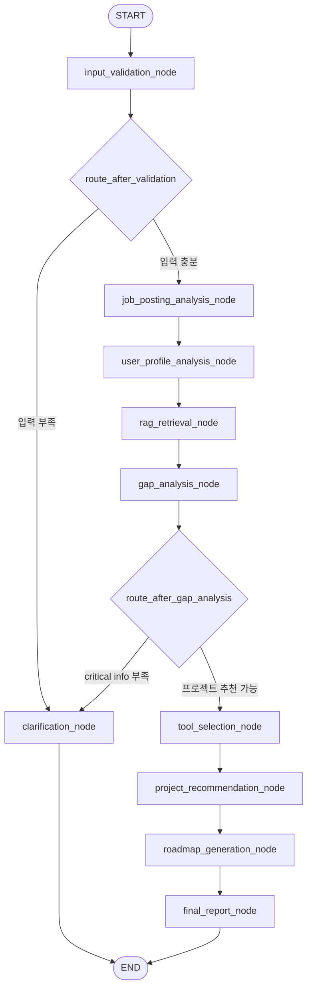

# JobFit Agent LangGraph Workflow

이 문서는 JobFit Agent Python backend의 LangGraph `StateGraph` 실행 흐름을 설명한다. 실제 구현은 `backend/app/graph_workflow.py`와 `backend/app/graph_nodes.py`에 있다.

## Mermaid Diagram



## Node Roles

- `input_validation_node`: 입력 길이, 필수 입력, 개인정보 마스킹, 추가 정보 필요 여부를 검사한다.
- `job_posting_analysis_node`: 채용공고와 회사 인재상에서 담당업무, 필수역량, 우대역량, 기술 키워드를 추출한다.
- `user_profile_analysis_node`: 사용자 기술스택, 프로젝트 경험, 자기소개서에서 확인 가능한 역량을 정리한다.
- `rag_retrieval_node`: `backend/rag/documents/*.md` 로컬 문서를 검색해 직무별 RAG context를 만든다.
- `gap_analysis_node`: 공고 요구역량과 사용자 역량을 비교해 부족 역량과 보완 항목을 만든다.
- `tool_selection_node`: 프로젝트 추천 단계로 넘어갈 수 있는 상태인지 결정한다.
- `project_recommendation_node`: 부족 역량과 RAG 근거를 바탕으로 프로젝트 3개를 추천한다.
- `roadmap_generation_node`: 준비 기간에 맞춰 주차별 학습/프로젝트 로드맵을 만든다.
- `final_report_node`: JSON 리포트와 Markdown 리포트를 구성한다.
- `clarification_node`: 입력이 부족할 때 사용자에게 추가 입력 요청을 만든다.

## Conditional Edges

- `route_after_validation(state)`
  - `validation_result.missing_fields`가 있거나 오류가 있으면 `clarification_node`로 이동한다.
  - 입력이 충분하면 `job_posting_analysis_node`로 이동한다.

- `route_after_gap_analysis(state)`
  - 채용공고와 사용자 경험이 모두 짧거나, 갭 분석 결과가 부족하면 `clarification_node`로 이동한다.
  - 프로젝트 추천이 가능하면 `tool_selection_node`로 이동한다.

## Mermaid Export

FastAPI 실행 후 아래 엔드포인트에서 현재 graph의 Mermaid 문자열을 확인할 수 있다.

```text
GET /agent/workflow-mermaid
```
