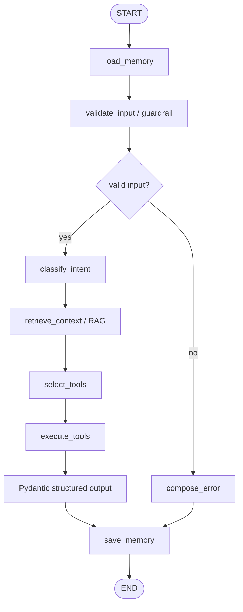

# JobFit Agent LangGraph Backend 보완 계획서

## 1. 현재 프로젝트 상태 요약

현재 저장소는 `Next.js + TypeScript` 기반 JobFit Agent 웹서비스가 중심이다. 사용자는 채용공고, 회사 인재상, 기술스택, 프로젝트 경험, 자기소개서/경험 서술, 준비 기간을 입력하고, 웹 UI에서 역량 갭 분석, 프로젝트 추천, 학습 로드맵, Markdown 리포트를 확인할 수 있다.

현재 주요 구조는 다음과 같다.

```text
src/
  app/
    api/
      analyze/
      recommend/
      report/
  components/jobfit/
  lib/
    ai/
    demo/
    errors/
    privacy/
    prompts/
    report/
    schemas/
    types/
docs/
  PRD.md
  TECH_DESIGN.md
  DEMO_SCENARIO.md
backend/
  app/
  data/
  main.py
  cli.py
  self_check.py
```

Next.js 쪽은 UI, API Route, Zod Schema, OpenAI JS SDK Adapter, Mock AI, 개인정보 마스킹, Markdown Export를 포함한다. 다만 최종 평가 요구사항은 `Python + LangChain + LangGraph` 기반 Agent 서비스이므로, 제출 핵심은 `backend/`로 명확히 분리해야 한다.

현재 `backend/`에는 최소 LangGraph Agent Core가 일부 존재한다. 그러나 평가 제출용으로는 사용자가 제시한 폴더 구조에 맞춰 `graph_state.py`, `graph_nodes.py`, `graph_workflow.py`, `tools/`, `rag/`, `backend/docs/`처럼 역할별 파일을 더 명확히 나누는 편이 좋다.

## 2. 평가 요구사항 매칭표

| 평가 요구사항 | 현재 Next.js 서비스 | 현재 backend 상태 | 제출 기준 판단 |
| --- | --- | --- | --- |
| Python 기준 구현 | 미충족 | 부분 충족 | `backend/`를 평가 핵심으로 문서화 필요 |
| LangChain 사용 | 미충족 | 부분 충족 | Tool, OutputParser 사용 근거 명확화 필요 |
| LangGraph `StateGraph` | 미충족 | 부분 충족 | workflow 파일과 Mermaid 다이어그램 분리 필요 |
| conditional edge | 미충족 | 부분 충족 | guardrail 분기 명시 필요 |
| 최소 2개 Tool | 미충족 | 충족 가능 | Tool 파일을 역할별로 분리 필요 |
| RAG 파이프라인 | 미충족 | 부분 충족 | 문서 파일을 직무별로 분리하고 검색 흐름 설명 필요 |
| 멀티턴 메모리 | localStorage 결과 유지 | 부분 충족 | `session_id` 기반 memory 설계 명확화 필요 |
| Middleware/Guardrail | Zod 검증, 마스킹 | 부분 충족 | FastAPI middleware와 graph guardrail 분리 필요 |
| 구조화 출력 | Zod Schema | 부분 충족 | Pydantic 모델과 OutputParser 사용 지점 명시 필요 |
| `.env` API Key 분리 | 충족 | 충족 가능 | backend 전용 `.env.example` 필요 |
| `requirements.txt` | 미해당 | 루트에 존재 | backend 기준 위치 또는 README 안내 필요 |
| README 문서화 | 웹서비스 중심 | 부분 반영 | 평가표 중심 README 보완 필요 |
| Workflow 다이어그램 | 없음 | 부분 가능 | `backend/docs/workflow.mmd` 추가 필요 |

## 3. 부족한 항목

현재 평가 기준에서 가장 큰 부족 항목은 다음이다.

1. `backend/` 구조가 평가 요구사항용 표준 구조로 정리되어 있지 않다.
2. `requirements.txt`가 루트에는 있으나, 제시된 예상 구조 기준으로는 `backend/requirements.txt`도 필요하다.
3. `backend/.env.example`, `backend/README_BACKEND.md`가 없다.
4. LangGraph 관련 코드가 `backend/app/agent.py`에 모여 있어 `graph_state.py`, `graph_nodes.py`, `graph_workflow.py`로 분리되지 않았다.
5. Tool 코드가 하나의 `tools.py`에 모여 있어 평가자가 Tool 구성을 빠르게 확인하기 어렵다.
6. RAG 문서가 `jobfit_knowledge.md` 하나로 묶여 있어 직무별 검색 문서 구성이 약해 보일 수 있다.
7. Workflow Mermaid 파일이 별도 산출물로 존재하지 않는다.
8. backend 전용 데모 시나리오 문서가 없다.
9. Next.js UI와 Python backend의 역할 분리가 README에서 더 강조되어야 한다.

## 4. 보완 전략

보완 전략은 기존 Next.js 코드를 유지하면서 `backend/`를 평가 핵심 Agent Core로 정리하는 것이다. 새 기능을 과하게 늘리기보다 평가표의 체크 항목이 바로 보이도록 파일과 문서를 재배치한다.

우선순위는 다음과 같다.

1. `backend/` 내부 구조를 평가 요구사항 구조에 맞춘다.
2. LangGraph StateGraph 구성 요소를 `graph_state.py`, `graph_nodes.py`, `graph_workflow.py`로 분리한다.
3. Tool을 `tools/job_posting_tools.py`, `tools/project_tools.py`, `tools/report_tools.py`로 분리한다.
4. RAG 문서를 직무별 Markdown으로 나누고 `rag/loader.py`, `rag/retriever.py`에서 검색한다.
5. `backend/docs/workflow.mmd`에 Mermaid 다이어그램을 저장한다.
6. `backend/README_BACKEND.md`에 Python Agent 실행 방법과 평가 요구사항 매칭을 정리한다.
7. 루트 README에는 “Next.js는 UI 데모, backend는 평가 핵심”이라고 명확히 쓴다.

## 5. 추가할 Python backend 폴더 구조

제출 기준 backend 구조는 다음을 목표로 한다.

```text
backend/
├── main.py
├── requirements.txt
├── .env.example
├── README_BACKEND.md
├── app/
│   ├── config.py
│   ├── schemas.py
│   ├── graph_state.py
│   ├── graph_nodes.py
│   ├── graph_workflow.py
│   ├── api.py
│   └── middleware.py
├── tools/
│   ├── job_posting_tools.py
│   ├── project_tools.py
│   └── report_tools.py
├── rag/
│   ├── loader.py
│   ├── retriever.py
│   └── documents/
│       ├── it_infra_skills.md
│       ├── backend_skills.md
│       ├── embedded_skills.md
│       ├── project_templates.md
│       └── portfolio_checklist.md
└── docs/
    ├── workflow.mmd
    └── demo_scenario.md
```

역할은 다음처럼 나눈다.

| 파일/폴더 | 역할 |
| --- | --- |
| `main.py` | FastAPI 앱 진입점 |
| `app/api.py` | `/agent/chat`, `/health`, `/workflow/mermaid` 라우터 |
| `app/config.py` | 환경변수, 모델명, Mock 모드 설정 |
| `app/schemas.py` | Pydantic 요청/응답/구조화 출력 모델 |
| `app/graph_state.py` | LangGraph State TypedDict 정의 |
| `app/graph_nodes.py` | memory, guardrail, tool 실행, 응답 생성 node |
| `app/graph_workflow.py` | StateGraph 조립, conditional edge, compile |
| `app/middleware.py` | 로깅, 안전한 에러 처리, 입력 마스킹 |
| `tools/` | LangChain Tool 정의 |
| `rag/` | 문서 로딩과 검색 |
| `backend/docs/` | Workflow 다이어그램과 backend 데모 문서 |

## 6. LangGraph workflow 초안

LangGraph는 `StateGraph`로 구성한다. 최소 조건부 분기는 입력 검증 결과를 기준으로 둔다.



조건부 edge 후보:

```text
validate_input
  -> compose_error   when input is too short or unsafe
  -> classify_intent when input is valid
```

추가 분기 후보:

```text
classify_intent
  -> project_recommendation path
  -> roadmap_generation path
  -> full_report path
```

## 7. Tool 목록

최소 2개 이상 요구사항을 안정적으로 만족하기 위해 4개 Tool을 설계한다.

| Tool | 위치 | 설명 |
| --- | --- | --- |
| `analyze_job_posting_tool` | `tools/job_posting_tools.py` | 채용공고에서 담당업무, 필수/우대 역량, 키워드 추출 |
| `analyze_gap_tool` | `tools/job_posting_tools.py` | 공고 요구역량과 사용자 경험 간 부족 역량 분석 |
| `recommend_project_tool` | `tools/project_tools.py` | 부족 역량 기반 프로젝트 추천 |
| `generate_report_tool` | `tools/report_tools.py` | 최종 결과를 Markdown/JSON 요약으로 정리 |

선택적으로 `generate_roadmap_tool`을 `project_tools.py`에 포함할 수 있다. 로드맵은 사용자가 선택한 준비 기간 하나만 생성하도록 제한한다.

## 8. RAG 문서 목록

RAG는 로컬 Markdown 문서 기반으로 시작한다. 벡터 DB는 MVP 제출 범위에서는 제외하고, keyword retriever로 구현한다.

문서 목록:

| 문서 | 내용 |
| --- | --- |
| `it_infra_skills.md` | Linux, Docker, Nginx, 모니터링, 장애 대응, 운영 문서화 |
| `backend_skills.md` | API 설계, DB, 인증/인가, 테스트, 배포, 운영 로그 |
| `embedded_skills.md` | C/C++, MCU, UART, CAN, GPIO, FreeRTOS, 디버깅 로그 |
| `project_templates.md` | 입문/중급/고급 프로젝트 범위와 산출물 기준 |
| `portfolio_checklist.md` | README, 테스트 결과, 실행 캡처, 회고, 면접 어필 포인트 |

RAG 흐름:

```text
user message
  -> query keywords 추출
  -> documents/*.md 로딩
  -> keyword score 계산
  -> top_k 문서 반환
  -> Agent state에 context로 저장
  -> Tool과 최종 응답 생성에 반영
```

## 9. Memory 설계

Memory는 `session_id` 기준 in-memory store로 시작한다.

저장 데이터:

```text
session_id
  -> user message
  -> agent answer
  -> selected tools
  -> last structured result summary
```

설계 원칙:

- DB는 사용하지 않는다.
- 서버 재시작 시 메모리는 사라져도 된다.
- 최근 N턴만 유지한다.
- 자기소개서나 개인정보 원문은 마스킹 후 저장한다.
- 추후 LangGraph checkpointer 또는 SQLite/Postgres memory로 확장 가능하게 경계를 둔다.

## 10. Middleware 설계

Middleware와 guardrail은 두 층으로 둔다.

### FastAPI middleware

- 요청 경로, 상태 코드, 처리 시간 로깅
- 내부 예외를 안전한 메시지로 변환
- 스택트레이스, API Key, 원문 민감정보 미노출

### Graph guardrail node

- 입력 길이 검증
- 이메일, 전화번호, 주민등록번호 형태, 긴 숫자 마스킹
- 채용/학습/프로젝트와 무관한 요청은 범위 안내
- 실패 시 conditional edge로 `compose_error` 이동

## 11. README 보완 계획

루트 README는 다음 방향으로 보완한다.

1. 저장소가 `backend/`와 `src/` 두 영역으로 구성된다는 점을 첫 부분에 명시한다.
2. 평가 핵심은 `backend/`의 Python LangGraph Agent라고 명시한다.
3. Python 설치와 실행 방법을 Next.js 실행 방법보다 먼저 배치한다.
4. 다음 항목을 표로 정리한다.
   - LangGraph StateGraph
   - conditional edge
   - Tool 목록
   - RAG 문서
   - Memory
   - Middleware/Guardrail
   - Pydantic 구조화 출력
5. Mermaid Workflow를 README와 `backend/docs/workflow.mmd`에 모두 포함한다.
6. `backend/README_BACKEND.md`에는 백엔드만 단독 실행하는 방법을 더 자세히 작성한다.
7. 한계점에는 keyword RAG, in-memory memory, 실제 크롤링 없음, 벡터 DB 미사용을 명확히 쓴다.

## 최종 제출 기준 파일 체크리스트

최종 제출 전 필요한 파일은 다음과 같다.

- `backend/main.py`
- `backend/requirements.txt`
- `backend/.env.example`
- `backend/README_BACKEND.md`
- `backend/app/config.py`
- `backend/app/schemas.py`
- `backend/app/graph_state.py`
- `backend/app/graph_nodes.py`
- `backend/app/graph_workflow.py`
- `backend/app/api.py`
- `backend/app/middleware.py`
- `backend/tools/job_posting_tools.py`
- `backend/tools/project_tools.py`
- `backend/tools/report_tools.py`
- `backend/rag/loader.py`
- `backend/rag/retriever.py`
- `backend/rag/documents/*.md`
- `backend/docs/workflow.mmd`
- `backend/docs/demo_scenario.md`
- 루트 `README.md`
- 루트 또는 backend 기준 `.gitignore`

이번 계획 단계에서는 코드 변경 없이 위 구조와 문서 보완 방향만 확정한다.
