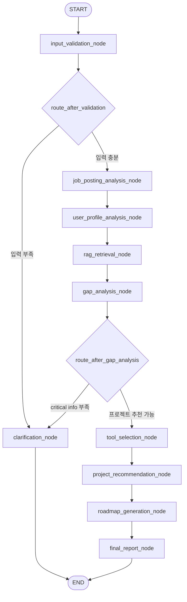

# JobFit Agent Workflow Diagram

이 문서는 최종 평가 제출용 LangGraph workflow 다이어그램입니다.

실제 구현 위치:

- `backend/app/graph_workflow.py`
- `backend/app/graph_nodes.py`
- `backend/app/graph_state.py`
- `backend/docs/workflow.mmd`
- `docs/workflow.mmd`
- `docs/workflow.png`

## PNG 이미지


## 제출용 Mermaid 다이어그램



## LangGraph 실행 흐름

1. `START`에서 `input_validation_node`로 진입합니다.
2. `route_after_validation` 조건부 분기에서 입력 부족 여부를 판단합니다.
3. 입력이 부족하면 `clarification_node`에서 추가 정보 요청을 반환하고 종료합니다.
4. 입력이 충분하면 채용공고 분석, 사용자 역량 분석, RAG 검색, 갭 분석을 순서대로 실행합니다.
5. `route_after_gap_analysis` 조건부 분기에서 프로젝트 추천 가능 여부를 판단합니다.
6. 추천 가능하면 프로젝트 추천, 로드맵 생성, 최종 리포트 생성을 수행합니다.
7. 최종 결과는 `AgentResponse`의 `report`에 구조화된 JSON으로 반환됩니다.

## 조건부 분기

| 조건 함수 | 반환값 | 다음 Node | 의미 |
| --- | --- | --- | --- |
| `route_after_validation` | `clarification` | `clarification_node` | 필수 입력 부족 |
| `route_after_validation` | `analyze` | `job_posting_analysis_node` | 분석 가능 |
| `route_after_gap_analysis` | `clarification` | `clarification_node` | 갭 분석 근거 부족 |
| `route_after_gap_analysis` | `recommend` | `tool_selection_node` | 프로젝트 추천 가능 |

## 실제 Mermaid 출력 확인

FastAPI backend 실행 후:

```powershell
curl http://127.0.0.1:8000/agent/workflow-mermaid
```

또는 Python에서 직접 확인:

```powershell
cd C:\Ucode\11_AIboot_FINAL
.\.venv\Scripts\Activate.ps1
python -c "import sys; sys.path.insert(0, 'backend'); from app.graph_workflow import get_workflow_mermaid; print(get_workflow_mermaid())"
```
